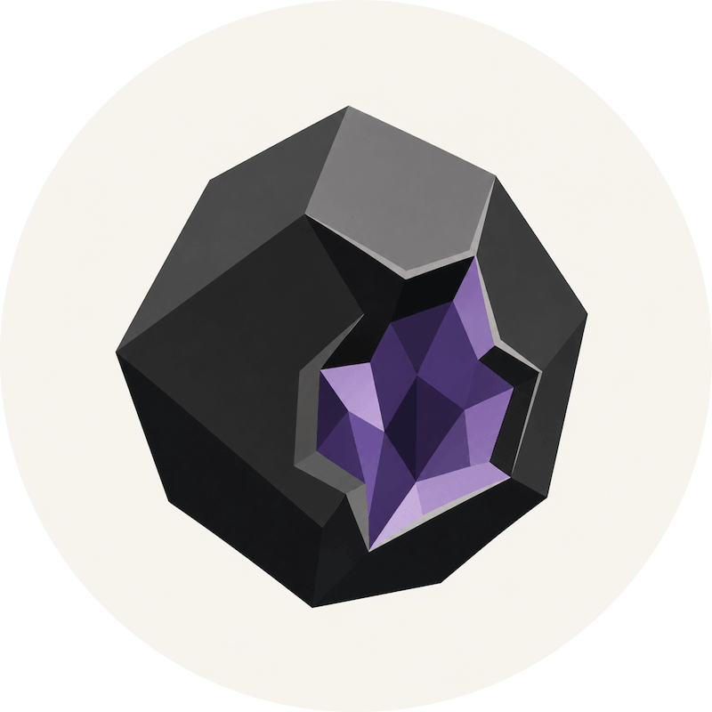

  

<!-- omit in toc -->
# Geode

**[Obsidian](https://obsidian.md) plugin** for remote sync, MCP, and an API for your vault.

- [Why?](#why)
- [Contributing](#contributing)
- [Security](#security)
- [License](#license)

## Why?

**Geode** is a free [Obsidian](https://obsidian.md) plugin that syncs your vault across multiple
devices (including iOS) through storage that you own, and encrypted locally on your device.

Our aim is to build the best remote sync plugin available for Obsidian users, whilst also offering
an remote MCP server and API to your vault, so that any agent (like Claude or Codex) can read/write
to the same vault, using it as memory.

TL;DR → Remote sync, using storage you own, encrypted, with MCP/API for your agents.

## Contributing

PRs are very welcome in the project, check out issues with the
[`"Good First Issue"`](https://github.com/8thpark/geode/issues?q=is%3Aissue%20state%3Aopen%20label%3A%22good%20first%20issue%22)
label and [CONTRIBUTING.md](./CONTRIBUTING.md) for more details.

## Security

Security is top concern for the project; every change is scanned by
[GitHub's CodeQL](https://codeql.github.com), the low number of dependencies we use are audited by
[Dependabot](https://github.com/dependabot) and
[NPM Audit](https://docs.npmjs.com/auditing-package-dependencies-for-security-vulnerabilities), and
our
[OpenSSF Scorecard](https://scorecard.dev/viewer/?uri=github.com/8thpark/geode&sort_by=check-score&sort_direction=desc)
updates on every change. Please see [SECURITY.md](./SECURITY.md) if you think you have found a
vulnerability or have questions.

## License

**Geode** is available under the [GNU General Public License v3.0](./LICENSE). You are free to use,
modify, and distribute it, provided any derivative work you distribute is also released under the
GPL-3.0.
