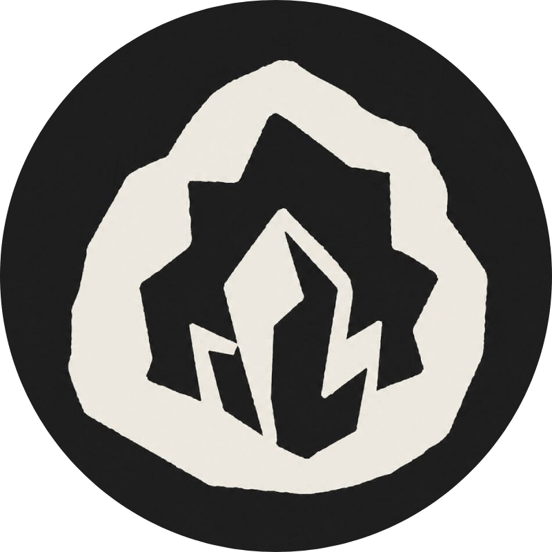

  

# Geode

[Obsidian](https://obsidian.md) plugin for remote sync, MCP, and an API for your vault.

## Why

Geode syncs your vault across your devices through storage you own, encrypted before anything
leaves your hands. Your agents read and write the same vault over MCP and an API, laptop asleep or
not. Your notes, your storage, your keys. Built for agents.

## License

Geode is available under the [Elastic License 2.0](./LICENSE): free to use, modify, and self-host.
The one thing you can't do is offer Geode itself to others as a hosted or managed service.
